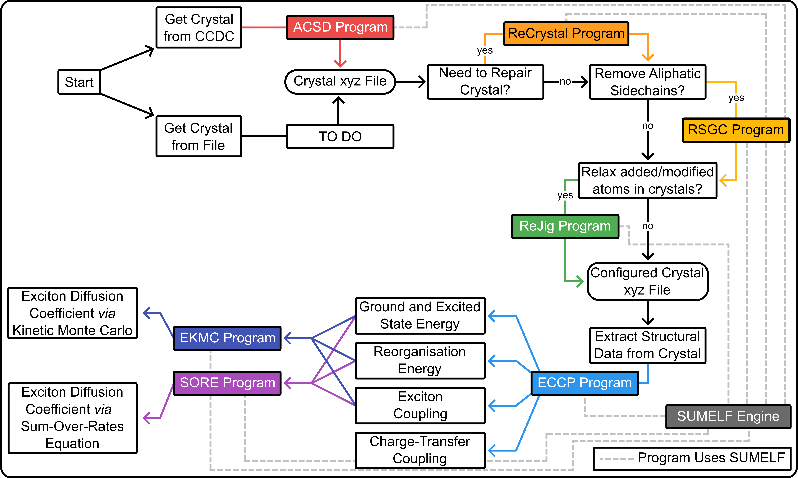

# The Supporting Methods for Electronic Functions (SUMELF)

Authors: Dr. Geoffrey Weal\*,†, Dr. Chayanit Wechwithayakhlung†, Dr. Josh Sutton\*, Dr. Daniel Packwood†, Dr. Paul Hume\*, Prof. Justin Hodgkiss\*

\* Victoria University of Wellington, Wellington, New Zealand; The MacDiarmid Institute for Advanced Materials and Nanotechnology, Wellington, New Zealand. 

† Institute for Integrated Cell-Material Sciences (iCeMS), Kyoto University, Kyoto, Japan.

Group pages: https://people.wgtn.ac.nz/paul.hume/grants, https://www.packwood.icems.kyoto-u.ac.jp/, https://people.wgtn.ac.nz/justin.hodgkiss/grants

## What is the Supporting Methods for Electronic Functions (SUMELF) program

The Supporting Methods for Electronic Functions (SUMELF) program contains various supporting methods that are used by various programs. This includes the ACSD, ReCrystals, RSGC, ECCP, EKMC, and SORE Programs. 

**ACSD: The Access Cambridge Structural Database Program**

* Used to collect crystals directly from the CCDC. 

**ReCrystals: The Repair Crystals Program**

* Used to repair and modify the molecules in the crystal.

**RSGC: The Remove SideGroups from Crystals Program**

* Used to remove sidegroups from the crystals, in particular aliphatic sidechains that are not significant to semiconductor properties and can make electronic calculations difficult. 

**ECCP: The Electronic Crystal Calculation Prep Program**

* Used to extract the molecules from the crystal and collect electronic calculation data for understanding coupling, charge-transfer, and energy-trasnfer for exciton and charge diffusion.

**EKMC: The Exciton Kinetic Monte Carlo Program**

* Used to simulate exciton diffusion using kinetic Monte Carlo.

**SORE: The Sum-Over-Rates Equation Program**

* Used to simulate exciton diffusion using a simple sum-over-rate equation model. 

## Installation

It is recommended to read the installation page before using the SUMELF program. See [Installation: Setting Up SUMELF and Pre-Requisites Packages](https://geoffreyweal.github.io/SUMELF/Installation) for more information. Note that you can install SUMELF through ``pip3`` and ``conda``. 

## Guide To Using SUMELF

The SUMELF program is one in a series of programs that are designed to be used in the workflow shown below. 

## The Grand Scheme

The SUMELF program is used as part of a grand scheme for calculating the excited-state electronic properties of molecules in a crystal. This includes simulations of exciton and charge diffusion through crystal structures, in particular for organic molecules (but not limited to them). This scheme is shown below, along with where the SUMELF program is used in this scheme. 

## Websites and Github Repositories for All Associated Programs

### Instructional Websites

* ACSD: https://geoffreyweal.github.io/ACSD
* ReCrystals: https://geoffreyweal.github.io/ReCrystals
* RSGC: https://geoffreyweal.github.io/RSGC
* ReJig: https://geoffreyweal.github.io/ReJig
* ECCP: https://geoffreyweal.github.io/ECCP
* EKMC: https://geoffreyweal.github.io/EKMC
* SORE: https://geoffreyweal.github.io/SORE
* SUMELF: https://geoffreyweal.github.io/SUMELF

### Github Repositories

* ACSD: https://github.com/geoffreyweal/ACSD
* ReCrystals: https://github.com/geoffreyweal/ReCrystals
* RSGC: https://github.com/geoffreyweal/RSGC
* ReJig: https://github.com/geoffreyweal/ReJig
* ECCP: https://github.com/geoffreyweal/ECCP
* EKMC: https://github.com/geoffreyweal/EKMC
* SORE: https://github.com/geoffreyweal/SORE
* SUMELF: https://github.com/geoffreyweal/SUMELF

